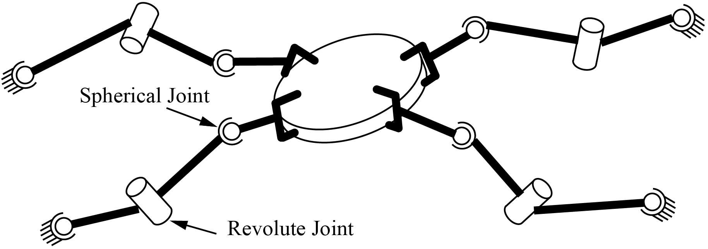
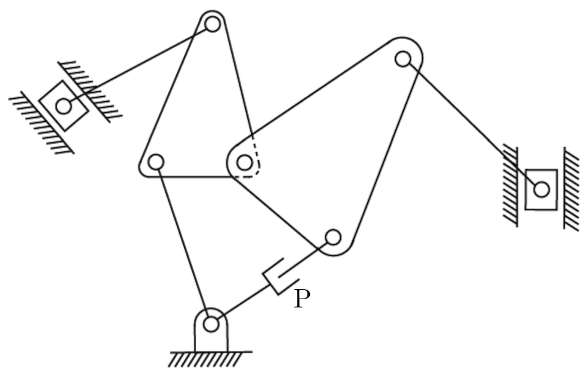

## Chapter 2 through 2.2, Configuration Space

### Question 1:
Using the methods for determining the number of degrees of freedom of a rigid body in 3-dimensional space from the book and the video, find the number of degrees of freedom of a rigid body in a conceptual 4-dimensional space.  Your answer should be an integer. 
Answer = "10"

--------------------------------------------------------------------------------------------------------------------------------------------------------
### Question 2:
Referring back to Question 1, indicate how many of the total degrees of freedom are angular (rotational).  Your answer should be an integer. 
Answer = "6"

--------------------------------------------------------------------------------------------------------------------------------------------------------
### Question 3:
Assume your arm, from your shoulder to your palm, has 7 degrees of freedom.  You are carrying a tray like a waiter, and you must keep the tray horizontal to avoid spilling drinks on the tray.  How many degrees of freedom does your arm have while satisfying the constraint that the tray stays horizontal?  Your answer should be an integer. 
Answer = "5"

--------------------------------------------------------------------------------------------------------------------------------------------------------
### Question 4:
Four identical SRS arms are grasping a common object as shown below.

Find the number of degrees of freedom of this system while the grippers hold the object rigidly (no relative motion between the object and the last links of the SRS arms).  Your answer should be an integer. 
Answer = "10"

--------------------------------------------------------------------------------------------------------------------------------------------------------
### Question 5:
Referring back to Question 4, suppose there are now a total of n such arms grasping the object. What is the number of degrees of freedom of this system? Your answer should be a mathematical expression including n.  Examples of mathematical expressions including n are 4∗n−7 or n/3. 
Answer = "n+6"

--------------------------------------------------------------------------------------------------------------------------------------------------------
### Question 6:
Referring back to Question 4 and 5, suppose the revolute joint in each of the n arms is now replaced by a universal joint. What is the number of degrees of freedom of the overall system? Your answer should be a mathematical expression including n.  Examples of mathematical expressions including n are 4∗n−7 or n/3. 
Answer = "2*n+6"

--------------------------------------------------------------------------------------------------------------------------------------------------------
### Question 7:
Use the planar version of Grubler's formula to determine the number of degrees of freedom of the mechanism shown below.  Your answer should be an integer.  (Remember that a single joint can only connect two rigid bodies, so if you see more than two connecting at a single point, there must be more than one joint there.  Also, the two blocks in the channels are only allowed to move prismatically in those channels, and one of the joints is labeled "P" for prismatic.  You will need to identify all the other joints, and links.) 
 
Answer: "3"
